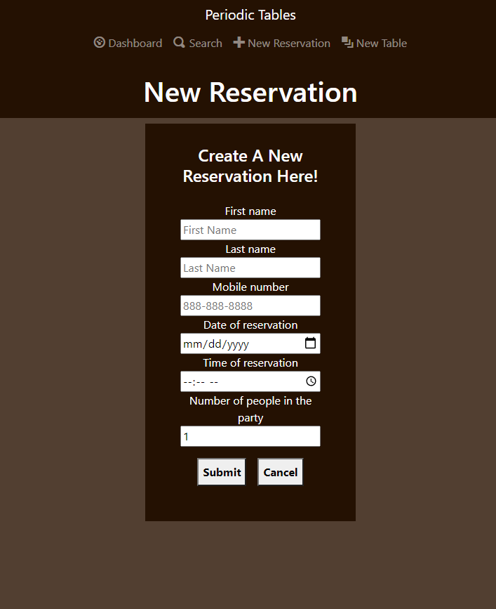
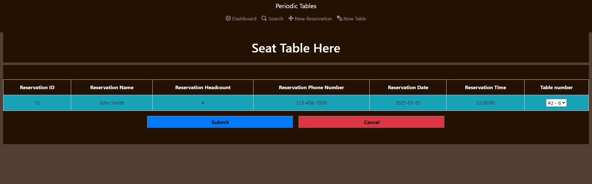
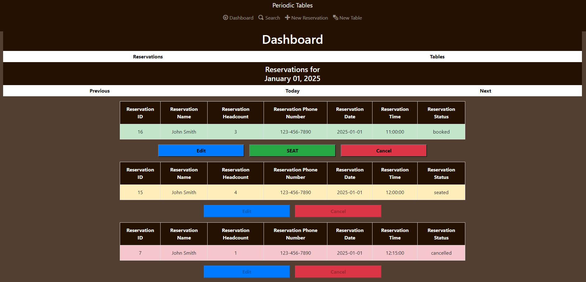
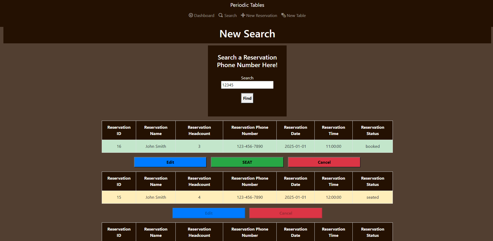
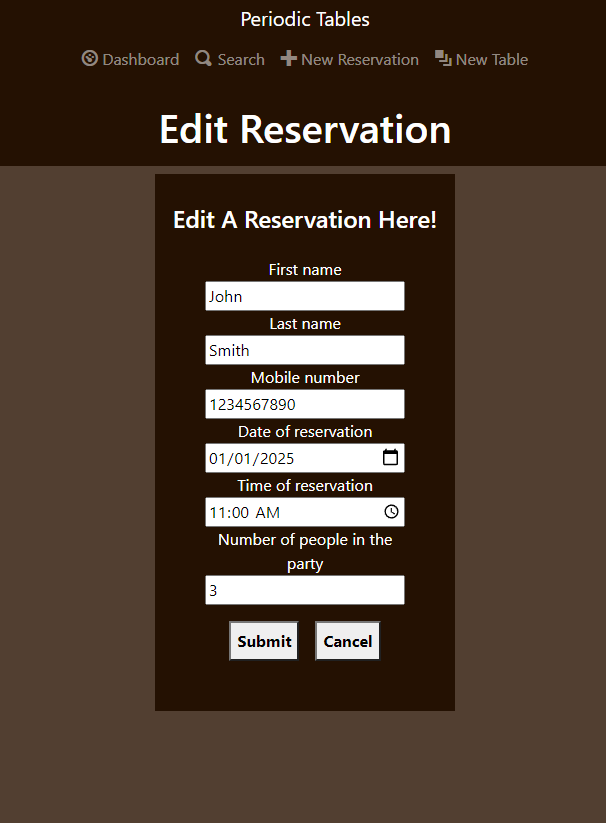
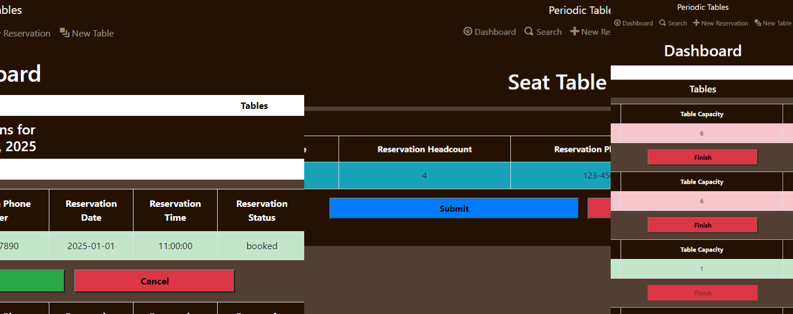
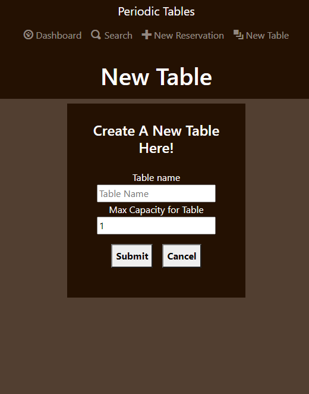
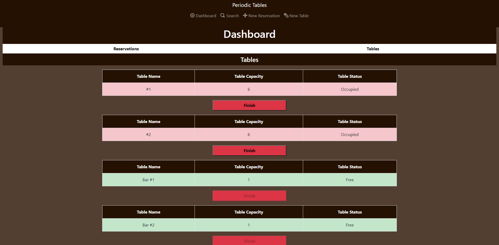
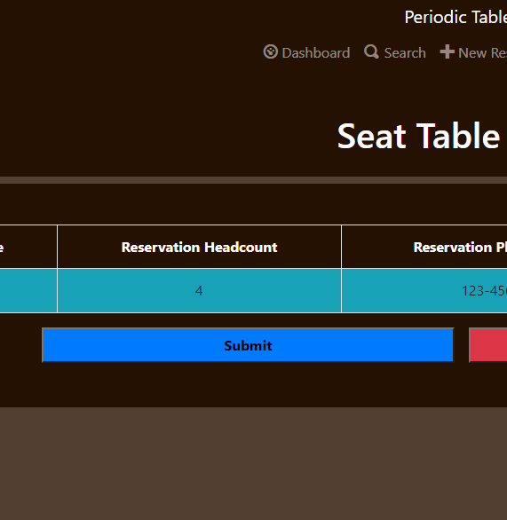
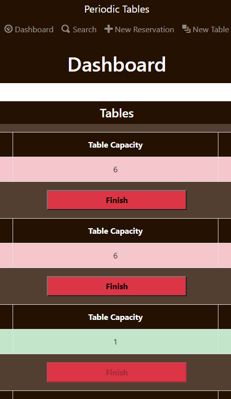

# Periodic Tables Restaurant Reservation System

### The Project

This is a Responsive Web Application designed for restaurants to create and manage reservations so they have an organized list of each reservation on a day to day basis.

This application can also manage the tables in the restaurant and the seating of reservations associated with them.

Finally, employees can search for a reservations' phone number in case they need to pull up a reservation quickly or they are having trouble finding it.

### The Tech

This application uses a mobile first approach combined with the PostgreSQL, Express.js, React, and Node.js (PERN) stack set up as a Monorepo.

I used Elephantsql for the database and Heroku for deployment. Heroku uses Amazon Web Services (AWS).

## Database setup

1. Set up four new ElephantSQL database instances - development, test, preview, and production.
1. After setting up your database instances, connect DBeaver to your new database instances.

### Knex

Run `npx knex` commands from within the `back-end` folder, which is where the `knexfile.js` file is located.

## Installation

1. Fork and clone this repository.
1. Run `cp ./back-end/.env.sample ./back-end/.env`.
1. Update the `./back-end/.env` file with the connection URL's to your ElephantSQL database instance.
1. Run `cp ./front-end/.env.sample ./front-end/.env`.
1. You should not need to make changes to the `./front-end/.env` file unless you want to connect to a backend at a location other than `http://localhost:5000`.
1. Run `npm install` to install project dependencies.
1. Run `npm run start:dev` to start your server in development mode.

## Existing API

Below is a list of each API currently used with screenshots. Each API takes an abort controller as it's signal.

### createReservation

The createReservation(newRes, signal) API takes the information listed below as newRes. It then sends a POST request to the back-end to add the new reservation to the reservation database. Finally it redirects the user to the dashboard listing the current reservations for the new reservation date:

### listOne

The listOne(params, signal) API takes a reservation_id as params then sends a GET request to the back-end to retrieve the specific reservation. This is used for seating a single reservation as shown below:

### listReservations

The listReservations(params, signal) API takes a date as params then sends a GET request to the back-end to retrieve every reservation on that date organized by time. This is used for the dashboard as shown below:

### searchRes

The searchRes(mobile_number, signal) API takes a series of numbers as mobile_number then sends a GET request to the back-end to retrieve every reservation who's mobile phone number includes the numbers used. Those reservations are then organized by date and time. This is used for the search function as shown below:

### editRes

The editRes(editRes, signal) API takes the information listed below as editRes. It then sends a PUT request to the back-end in order to update the same reservation with the new data in the database. It then returns the user to the previous page:

### updateRes

The updateRes(reservation_id, status, signal) API takes a reservation id and a new status as its parameters then it sends a PUT request to the back-end in order to update the reservation matching the id with the new status. These statuses can be updated from booked to cancelled (using the cancel button in the dashboard or search results as shown below), booked to seated (using the submit button in the seatings page as shown below), or from seated to finished (using the finish button in the dashboard as shown below):

### createTable

The createTable(newTab, signal) API takes information listed below as newTab. It then sends a POST request to the back-end to add the table to the database. Finally it redirect the user to the dashboard listing all tables:

### listTables

The listTables(signal) API sends a GET request to the back-end in order to return a complete list of tables in the database organized by name. This is used for the dashboard as shown below:

### updateTable

The updateTable(table_id, reservation_id, signal) API takes a table id and reservation id as it's parameters. It then sends a PUT request to the back-end to update the table with the reservation id of the reservation seated. This can be done by pressing the submit button in the seatings page as shown below:

### removeTable

The removeTable(table_id, signal) API takes a table id as its parameter. It then sends a DELETE request to the back-end that deletes the reservation id listed for the table to allow for another reservation to be seated there. This can be done by pressing the finish button in the dashboard as shown below:

